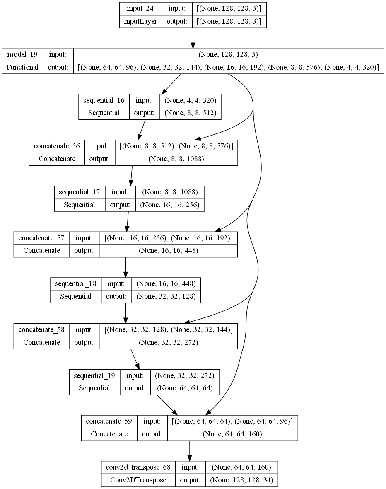

# Image Segmentation for Cityscape Dataset with U-Net Architecture
 An image segmentation project using U-Net deep learning architecture.

## Visualization

## Acknowledgement
A huge thank you to [DanB](https://www.kaggle.com/datasets/dansbecker/cityscapes-image-pairs) from Kaggle for providing the dataset used in this project.
